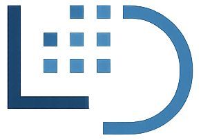

::: {.ld-hero}
::: {.container-page}
::: {.ld-split}
::: {}
[Em construção · v0.1]{.ld-eyebrow}

# Pesquisa empírica em direito, **com ciência aberta**

::: {.lead}
O LabDados é um laboratório da **FGV Direito SP** que constrói ferramentas, conduz pesquisas e ensina pessoas a usar dados para entender o sistema de justiça brasileiro. Tudo que produzimos (código, dados, métodos) é publicado abertamente.
:::

[Ver ferramentas](ferramentas/index.qmd){.ld-cta .ld-cta--primary}
[Sobre o laboratório](sobre/index.qmd){.ld-cta .ld-cta--ghost}
:::

::: {.ld-hero-mark}

:::
:::
:::
:::

::: {.container-page}

::: {.ld-section}
## O que fazemos

::: {.lead}
Três frentes que se reforçam: **ferramentas** que retiram fricção da pesquisa empírica, **pesquisas** que usam essas ferramentas em problemas reais, e **formação** para que outras pessoas possam fazer o mesmo.
:::

```{=html}
<div class="ld-grid">
  <div class="ld-card">
    <span class="ld-card__tag">ferramentas</span>
    <h3><a class="ld-card__link" href="ferramentas/">Pacotes Python e dados abertos</a></h3>
    <p>Bibliotecas para coletar, estruturar e analisar dados do Judiciário brasileiro, incluindo <code>juscraper</code>, <code>dataframeit</code> e o SDK <code>labdados</code> do escritório de apoio.</p>
  </div>
  <div class="ld-card">
    <span class="ld-card__tag">pesquisa</span>
    <h3><a class="ld-card__link" href="pesquisas/">Pesquisas em andamento</a></h3>
    <p>Projetos com parceiros institucionais e sociedade civil em judicialização da saúde, jurisprudência do TCU e IA na pesquisa em direito.</p>
  </div>
  <div class="ld-card">
    <span class="ld-card__tag">aprenda</span>
    <h3><a class="ld-card__link" href="aprenda/">Cursos, livro e workshops</a></h3>
    <p>Materiais abertos de programação aplicada à pesquisa em direito, agenda de workshops e o livro em construção.</p>
  </div>
</div>
```

:::

::: {.ld-section}
## Escritório de apoio

```{=html}
<a class="ld-callout" href="https://labdados-frontend.livelydesert-3e3e3dd8.brazilsouth.azurecontainerapps.io" target="_blank" rel="noopener">
  <div>
    <h3>Precisa de OCR, transcrição ou estruturação de textos para uma pesquisa?</h3>
    <p>O escritório de apoio do LabDados processa PDFs, áudio e textos sob demanda. Modos nuvem e local, dados em Brazil South com retenção de 72h.</p>
  </div>
  <span class="ld-cta">Acessar o portal →</span>
</a>
```

[Como funciona o escritório](escritorio/){.ld-cta .ld-cta--ghost style="margin-top: -0.75rem;"}
:::

::: {.ld-section}
## Manifesto

::: {.ld-manifesto}
Pesquisa empírica em direito ainda é cara, manual e fechada. Nosso trabalho é mudar isso.
Cada raspador, cada pacote, cada curso e cada artigo do LabDados é publicado em código aberto e versionado em GitHub.
:::

[Leia mais sobre como nos organizamos](sobre/index.qmd){.ld-cta .ld-cta--ghost}
:::

```{=html}
<div class="container-page" style="padding-block: 3rem;"></div>
```
:::
